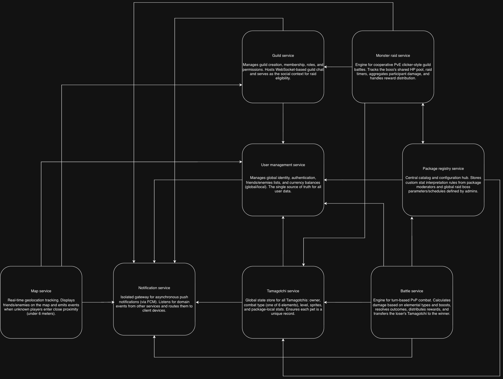

# Tamagotchi Go — Team 13

**Topic 2 — Tamagotchi Go · Service Boundaries, Technology Stack & Communication Contract**

This document defines the architecture and communication contracts for the microservices behind **Tamagotchi Go**, a location-based virtual-pet platform where independently developed client applications ("packages") plug into one shared backend. Every endpoint that touches user identity or user-owned data authenticates through a **JWT (JSON Web Token)** passed in the `Authorization` header and issued by the User Management Service.

---

## Overview

Players raise Tamagotchis inside a package of their choosing, walk around the real world, run into other players, battle their creatures, form guilds and team up against shared monsters — all while keeping their pets fed and happy.

The critical constraint of this system is that **packages are not uniform**. One package may model its pets with hunger, happiness and tiredness; another with energy, mood, discipline and creativity. The backend therefore separates *globally meaningful* state (identity, level, combat type, global currency, guild membership) from *package-local* state (health statistics, growth mechanics, local currency), and never forces the two to share a schema.

The platform is split into **8 microservices**, each owning a distinct domain and its own database. No service reads another service's tables — all cross-service data flows through REST calls or asynchronous events.

---

## Team & Service Ownership

| # | Owner | Services |
|---|-------|----------|
| 1 | **Costov Maxim** | User Management Service, Battle Service |
| 2 | **Cvasiuc Dmitrii** | Tamagotchi Service, Notification Service |
| 3 | **Tatarintev Denis** | Map Service, Monster Raid Service |
| 4 | **Obrijan Filip** | Guild Service, Package Registry Service |

Services are paired by coupling: each owner holds the two services that talk to each other most often, which keeps cross-owner coordination to the documented contract below.

---

## Technologies & Communication Patterns

| Owner | Services | Language & Framework | Database | Communication Patterns | Motivation & Trade-offs |
|-------|----------|----------------------|----------|------------------------|-------------------------|
| **Costov Maxim** | User Management, Battle | **Go** (Gin + GORM) | PostgreSQL | REST with JWT issuance, WebSockets for live battle state, atomic transactions | Identity and currency are the consistency-critical core: registration, friendship and the global-currency ledger all demand ACID transactions, which is why both services sit on PostgreSQL. Go's standard library covers JWT signing and password hashing without heavy framework buy-in, and its static typing makes the damage formula — level, type multiplier, boosts, stat bonus — hard to get silently wrong. Battle holds only transient match state and persists outcomes, so a crash mid-battle never corrupts the ledger. |
| **Cvasiuc Dmitrii** | Tamagotchi, Notification | **Go** (Gin + GORM) | PostgreSQL | REST, async event consumption, Firebase Cloud Messaging fan-out | Goroutines and channels make the Notification Service's fan-out cheap — thousands of concurrent FCM deliveries cost almost nothing per connection, and `context` gives clean per-request cancellation and timeouts against a flaky external provider. Gin keeps the Tamagotchi Service's read-heavy endpoints fast, while `jsonb` columns let each package store its own unnormalized stat shape without migrations. The trade-off is more boilerplate than a dynamic language, accepted for compile-time safety on the type-advantage logic. |
| **Tatarintev Denis** | Map, Monster Raid | **C#** (ASP.NET Core + EF Core) | PostgreSQL + PostGIS | REST, SignalR for live raid state, idempotent operations | NetTopologySuite gives EF Core first-class geometry types over PostGIS, so proximity queries use real spatial indexes instead of hand-rolled distance math over every user. SignalR handles the raid clicker's live HP fan-out with reconnection and group management built in, which matters because raid damage arrives concurrently from many guild members — every write is idempotent via `event_id` so a reconnecting client can retry without double-counting. |
| **Obrijan Filip** | Guild, Package Registry | **C#** (ASP.NET Core + EF Core) | PostgreSQL | REST, SignalR for guild chat, configuration-as-data | SignalR groups map one-to-one onto guild chat rooms, removing most of the connection bookkeeping a raw WebSocket server would need. EF Core migrations suit Package Registry's schema-heavy configuration surface, and because it is a low-write, high-read authority whose stat definitions are polled constantly by Battle and Monster Raid, its responses are aggressively cacheable and it never sits on a hot write path. |

> **Note:** The team satisfies the two-language requirement with **Go** (Costov Maxim, Cvasiuc Dmitrii) and **C#** (Tatarintev Denis, Obrijan Filip). Both halves speak the same REST/JSON contract documented below, so the language split is invisible across service boundaries — the only cross-stack concern is keeping WebSocket frame shapes identical between Go's `gorilla/websocket` and .NET's SignalR, which the contract pins down explicitly.

---

## Architecture Diagram



**How the services communicate:**

- **Notification Service** is the delivery boundary — every service except Package Registry publishes events to it, and it alone talks to Firebase Cloud Messaging. It never decides *what* an event means, only how it reaches the client.
- **User Management Service** is the identity root — Map, Guild and Tamagotchi resolve users and relationships through it, Battle credits global currency and XP through it, and Package Registry grants moderator/admin roles through it.
- **Package Registry Service** is the configuration authority — Battle and Monster Raid read stat-interpretation rules from it before computing damage, and it supplies the stat definitions used when a new Tamagotchi is created.
- **Monster Raid Service** asks Guild Service *"is this player a member of the guild this raid is bound to?"* before admitting anyone to the boss clicker, and exchanges monster definitions with Package Registry in both directions.

---

## Service Boundaries

Each microservice encapsulates one domain so that services can be developed, deployed and scaled independently. Where a boundary is easy to get wrong, the section explicitly states what the service **does not** own.

### 1. User Management Service

Owns global user identity: registration, credentials, email, and which package(s) a user is registered with. Maintains each user's **friends and enemies**. Owns both currencies — **local currency**, whose value and acquisition are defined by the individual package, and **global currency**, shared across the entire ecosystem and earned primarily through battles and global activities.

It is the single authority for *"who is this user?"*, *"are these users friends?"* and *"does this user have enough global currency?"*. No other service duplicates identity or relationship data.

**Does not own:** Tamagotchis, guild membership, or any package-specific game mechanics.

### 2. Battle Service

Owns the execution of **turn-based PvP combat** after a match is created. Each player selects one primary and one secondary Tamagotchi and may equip battle boosts. Combat resolves starting health from Tamagotchi levels, then computes damage from primary/secondary level, type advantage/disadvantage, equipped boosts and current package-local health statistics, tracking battle state and whose turn it is.

On completion the winner receives global currency and XP; the loser loses some global currency, receives less XP, and their **primary Tamagotchi** is transferred to the winner. XP is distributed between primary and secondary Tamagotchis on a defined rule (60/40).

**Does not own:** user identity, currency balances, or Tamagotchi definitions — it reads them and requests mutations through the owning services. It only owns in-progress battle state and battle outcomes.

### 3. Tamagotchi Service

Owns the globally relevant state of every Tamagotchi: **identity, owner, combat type, level, sprite references** and **package-local health statistics** (hunger, tiredness, happiness, etc.), which are deliberately **not normalized** because their management is package-specific.

Defines the six combat types and their advantage cycle:

```
Flame → Nature → Earth → Electric → Water → Shadow → Flame
```

Each user has exactly one **primary Tamagotchi**, initially supplied by the package they downloaded, and may acquire **secondary Tamagotchis** originating from other users/packages. **Secondary Tamagotchis are references to existing entries, not new records** — a given Tamagotchi exists exactly once in the system.

**Does not own:** combat resolution or the interpretation rules for package-local stats (those live in Package Registry).

### 4. Notification Service

Owns asynchronous delivery of events to users through **Firebase Cloud Messaging**. Other services publish domain events without knowing anything about device tokens, delivery, or reachability; this service decides how an event reaches a client.

Delivered events include: friend request received, nearby player detected, battle request received, another player used/captured a Tamagotchi, guild invitation, and raid started.

**Does not own:** the business meaning of events — it is a delivery boundary, not a decision-maker.

### 5. Map Service

Owns each user's **latest known coordinates and timestamp**, ingesting continuous geolocation updates from client applications and discarding or ignoring stale locations. Serves the nearby-players map: **friends and enemies are always visible**, while unknown users only become relevant once within roughly **6 meters** of one another.

When two previously unrelated users cross the proximity threshold, the service emits an event that may result in a suggestion to **befriend or battle** one another.

**Does not own:** battles or notifications. It reports proximity and emits events; it never decides what happens next.

### 6. Monster Raid Service

Owns **cooperative clicker-style raids** in which guild members collectively fight a single powerful monster with a large HP pool and a fixed duration. Any eligible guild member may contribute their **primary Tamagotchi**; instead of one-on-one combat, every participating Tamagotchi deals damage to the same monster, with per-hit damage derived from that Tamagotchi's combat properties and equipped boosts.

Maintains current monster HP, participating users, damage dealt, timestamps and raid status. On a kill it distributes rewards (global currency, XP, other globally managed rewards); a raid may also **fail** when its timer expires.

**Does not own:** monster definitions (Package Registry) or guild membership (Guild Service).

### 7. Guild Service

Owns **guild identity, membership, roles and permissions** — a guild has an owner/leader, officers and ordinary members. Provides **Guild Chat** over WebSockets, with messages associated to a guild and carrying timestamps and authors.

Guilds are the social context for Monster Raids: members join an active raid and their primary Tamagotchis become participants in the shared battle. Membership and invitation rules resolve user identity and relationships through the User Management Service.

**Does not own:** raid state, battle outcomes, or user identity.

### 8. Package Registry Service

Owns the catalog of **packages** participating in the ecosystem — identifier/name, version, description, status and associated developers/moderators — plus the record of which users are registered with which packages. Acts as the **configuration service for package-specific and global game content**.

**Moderators** are privileged users tied to a package who define that package's **local Tamagotchi growth mechanics and statistics**. Because packages may use completely different, non-normalized statistics, this service stores the **definition and interpretation rules** for them: a statistic's maximum value, and the thresholds at which it produces a combat bonus. The Battle Service consults these definitions to apply package-specific bonuses without requiring all packages to share a data structure.

**Admins** are globally privileged users who design and schedule **Monster Raids**, defining monster name, description, sprites, maximum HP, combat statistics, weaknesses, resistances, special properties, raid duration, participant limits and reward configuration, and who may schedule, activate, deactivate or cancel raids.

---

## Authentication

Endpoints marked **Headers: `Authorization: Bearer <jwt>`** require a valid user JWT issued by the **User Management Service**. The token carries:

- `sub` — the user UUID
- `package_id` — the package the session belongs to
- `roles` — e.g. `["user"]`, `["user", "moderator"]`, `["user", "admin"]`

Service-to-service calls (e.g. Battle → Tamagotchi) use a dedicated **service JWT** signed with a shared internal secret and are marked **`Authorization: Bearer <service_jwt>`**.

All write endpoints that can be retried by a client or replayed by an event bus accept an **`event_id`** and are **idempotent**: repeating a call with the same `event_id` returns the original result without applying the effect twice.

---

## Communication Contract

All payloads and responses are **JSON** over HTTP, plus WebSocket frames where noted.

---

### 1. User Management Service

**Base path:** `/api/users`

#### Register a User

`POST /api/users/register`
Creates a new account and links it to the package it registered from.

```json
{
  "username": "dima_trainer",
  "email": "trainer@faf.university",
  "password": "<plain_password>",
  "package_id": "pkg-uuid-001"
}
```

Success (201 Created):

```json
{
  "user_id": "user-uuid-123",
  "username": "dima_trainer",
  "packages": ["pkg-uuid-001"],
  "global_currency": 0
}
```

Error (409 Conflict):

```json
{ "error": "Username or email already registered." }
```

#### Login

`POST /api/users/login`

```json
{ "email": "trainer@faf.university", "password": "<plain_password>" }
```

Success (200 OK):

```json
{
  "jwt": "<jwt_token>",
  "user_id": "user-uuid-123",
  "roles": ["user"],
  "expires_in": 3600
}
```

#### Get User Profile

`GET /api/users/{user_id}`
Headers: `Authorization: Bearer <jwt>`

```json
{
  "user_id": "user-uuid-123",
  "username": "dima_trainer",
  "packages": ["pkg-uuid-001", "pkg-uuid-004"],
  "global_currency": 1250,
  "created_at": "2026-09-09T12:00:00Z"
}
```

#### Get Relationship Between Two Users

`GET /api/users/{user_id}/relationship/{other_user_id}`
Used by Map, Guild and Battle Services to resolve visibility and eligibility.
Headers: `Authorization: Bearer <service_jwt>`

```json
{
  "user_id": "user-uuid-123",
  "other_user_id": "user-uuid-456",
  "relation": "friend"
}
```

`relation` is one of `friend`, `enemy`, `none`.

#### Send Friend Request

`POST /api/users/{user_id}/friends`
Headers: `Authorization: Bearer <jwt>`

```json
{ "target_user_id": "user-uuid-456" }
```

Success (202 Accepted):

```json
{ "request_id": "req-uuid-001", "status": "pending" }
```

#### Respond to a Friend Request

`PATCH /api/users/{user_id}/friends/{request_id}`
Headers: `Authorization: Bearer <jwt>`

```json
{ "action": "accept" }
```

`action` is one of `accept`, `decline`, `block`. `block` moves the user into the enemies list.

#### List Friends and Enemies

`GET /api/users/{user_id}/friends`
Headers: `Authorization: Bearer <jwt>`

```json
{
  "friends": [
    { "user_id": "user-uuid-456", "username": "kiki", "status": "online" }
  ],
  "enemies": [
    { "user_id": "user-uuid-789", "username": "pumpkin" }
  ]
}
```

#### Get Currency Balances

`GET /api/users/{user_id}/currency`
Headers: `Authorization: Bearer <jwt>`

```json
{
  "user_id": "user-uuid-123",
  "global_currency": 1250,
  "local_currency": [
    { "package_id": "pkg-uuid-001", "amount": 430 },
    { "package_id": "pkg-uuid-004", "amount": 75 }
  ]
}
```

#### Adjust Currency

`POST /api/users/{user_id}/currency`
Internal endpoint used by Battle and Monster Raid Services. Idempotent via `event_id`.
Headers: `Authorization: Bearer <service_jwt>`

```json
{
  "event_id": "evt-uuid-battle-001",
  "currency": "global",
  "amount": 120,
  "reason": "battle_won"
}
```

Success (200 OK):

```json
{ "user_id": "user-uuid-123", "currency": "global", "balance": 1370 }
```

Error (409 Conflict):

```json
{ "error": "Insufficient global currency." }
```

---

### 2. Battle Service

**Base path:** `/api/battles`

#### Create a Battle

`POST /api/battles`
Both players nominate a primary and a secondary Tamagotchi and optional boosts.
Headers: `Authorization: Bearer <jwt>`

```json
{
  "challenger_id": "user-uuid-123",
  "opponent_id": "user-uuid-456",
  "challenger_lineup": {
    "primary_id": "tama-uuid-001",
    "secondary_id": "tama-uuid-002",
    "boosts": ["boost-atk-01"]
  }
}
```

Success (201 Created):

```json
{
  "battle_id": "battle-uuid-001",
  "status": "awaiting_opponent",
  "created_at": "2026-09-09T12:05:00Z"
}
```

Error (403 Forbidden):

```json
{ "error": "Opponent has blocked this user." }
```

#### Accept a Battle

`POST /api/battles/{battle_id}/accept`
Headers: `Authorization: Bearer <jwt>`

```json
{
  "primary_id": "tama-uuid-101",
  "secondary_id": "tama-uuid-102",
  "boosts": []
}
```

Success (200 OK):

```json
{
  "battle_id": "battle-uuid-001",
  "status": "in_progress",
  "turn": "user-uuid-123",
  "state": {
    "challenger_hp": 340,
    "opponent_hp": 310
  }
}
```

#### Get Battle State

`GET /api/battles/{battle_id}`
Headers: `Authorization: Bearer <jwt>`

```json
{
  "battle_id": "battle-uuid-001",
  "status": "in_progress",
  "turn": "user-uuid-456",
  "turn_number": 4,
  "participants": [
    {
      "user_id": "user-uuid-123",
      "primary": { "tamagotchi_id": "tama-uuid-001", "type": "flame", "level": 12, "hp": 210 },
      "secondary": { "tamagotchi_id": "tama-uuid-002", "type": "water", "level": 8 }
    },
    {
      "user_id": "user-uuid-456",
      "primary": { "tamagotchi_id": "tama-uuid-101", "type": "nature", "level": 11, "hp": 145 },
      "secondary": { "tamagotchi_id": "tama-uuid-102", "type": "shadow", "level": 9 }
    }
  ]
}
```

#### Perform a Turn

`POST /api/battles/{battle_id}/turns`
Headers: `Authorization: Bearer <jwt>`

```json
{
  "user_id": "user-uuid-123",
  "action": "attack",
  "source": "primary",
  "boost_id": null
}
```

Success (200 OK):

```json
{
  "turn_number": 5,
  "damage_dealt": 47,
  "type_multiplier": 1.5,
  "boost_multiplier": 1.0,
  "stat_bonus": 1.1,
  "opponent_hp": 98,
  "next_turn": "user-uuid-456",
  "battle_over": false
}
```

Error (409 Conflict):

```json
{ "error": "Not this player's turn." }
```

#### Battle Result

`GET /api/battles/{battle_id}/result`
Headers: `Authorization: Bearer <jwt>`

```json
{
  "battle_id": "battle-uuid-001",
  "winner_id": "user-uuid-123",
  "loser_id": "user-uuid-456",
  "rewards": {
    "winner": {
      "global_currency": 120,
      "xp": { "primary": 60, "secondary": 40 },
      "captured_tamagotchi_id": "tama-uuid-101"
    },
    "loser": {
      "global_currency": -60,
      "xp": { "primary": 24, "secondary": 16 }
    }
  },
  "finished_at": "2026-09-09T12:11:30Z"
}
```

#### Forfeit

`POST /api/battles/{battle_id}/forfeit`
Headers: `Authorization: Bearer <jwt>`

#### WebSocket — Live Battle

`wss://api.tamagotchi-go/ws/battles/{battle_id}?token=<jwt>`

Server → Client:

```json
{ "type": "battle_started",  "battle_id": "...", "first_turn": "user-uuid-123" }
{ "type": "turn_played",     "turn_number": 5, "actor_id": "...", "damage": 47, "opponent_hp": 98 }
{ "type": "turn_changed",    "turn": "user-uuid-456", "deadline": "2026-09-09T12:12:00Z" }
{ "type": "battle_finished", "winner_id": "...", "captured_tamagotchi_id": "tama-uuid-101" }
```

---

### 3. Tamagotchi Service

**Base path:** `/api/tamagotchis`

#### Get Type Advantage Matrix

`GET /api/tamagotchis/types`
Public reference data consumed by Battle and Monster Raid Services.

```json
{
  "cycle": ["flame", "nature", "earth", "electric", "water", "shadow"],
  "multipliers": { "advantage": 1.5, "neutral": 1.0, "disadvantage": 0.75 },
  "types": [
    { "type": "flame",    "strong_against": "nature",   "weak_against": "shadow" },
    { "type": "nature",   "strong_against": "earth",    "weak_against": "flame" },
    { "type": "earth",    "strong_against": "electric", "weak_against": "nature" },
    { "type": "electric", "strong_against": "water",    "weak_against": "earth" },
    { "type": "water",    "strong_against": "shadow",   "weak_against": "electric" },
    { "type": "shadow",   "strong_against": "flame",    "weak_against": "water" }
  ]
}
```

#### Create a Tamagotchi

`POST /api/tamagotchis`
Called when a user registers with a package and receives their starter pet.
Headers: `Authorization: Bearer <service_jwt>`

```json
{
  "owner_id": "user-uuid-123",
  "package_id": "pkg-uuid-001",
  "name": "Blazey",
  "type": "flame",
  "sprite_ref": "pkg-uuid-001/sprites/blazey.png",
  "stats": { "hunger": 100, "tiredness": 0, "happiness": 80 }
}
```

Success (201 Created):

```json
{
  "tamagotchi_id": "tama-uuid-001",
  "owner_id": "user-uuid-123",
  "package_id": "pkg-uuid-001",
  "type": "flame",
  "level": 1,
  "xp": 0,
  "is_primary": true
}
```

#### Get a Tamagotchi

`GET /api/tamagotchis/{tamagotchi_id}`
Headers: `Authorization: Bearer <jwt>`

```json
{
  "tamagotchi_id": "tama-uuid-001",
  "owner_id": "user-uuid-123",
  "package_id": "pkg-uuid-001",
  "name": "Blazey",
  "type": "flame",
  "level": 12,
  "xp": 3400,
  "sprite_ref": "pkg-uuid-001/sprites/blazey.png",
  "stats": { "hunger": 42, "tiredness": 70, "happiness": 91 },
  "is_primary": true
}
```

> `stats` is an opaque, package-defined object. Its keys differ per package and are interpreted using the definitions served by the Package Registry Service.

#### List a User's Tamagotchis

`GET /api/tamagotchis?owner_id={user_id}`
Returns the primary Tamagotchi plus every secondary reference the user holds.
Headers: `Authorization: Bearer <jwt>`

```json
{
  "owner_id": "user-uuid-123",
  "primary": { "tamagotchi_id": "tama-uuid-001", "name": "Blazey", "type": "flame", "level": 12 },
  "secondary": [
    { "tamagotchi_id": "tama-uuid-101", "name": "Leafy", "type": "nature", "level": 11, "origin_package_id": "pkg-uuid-004" }
  ]
}
```

#### Update Package-Local Statistics

`PATCH /api/tamagotchis/{tamagotchi_id}/stats`
Called by the package client as the pet is fed, rested or played with. Keys are not validated against a global schema.
Headers: `Authorization: Bearer <jwt>`

```json
{ "stats": { "hunger": 90, "tiredness": 55 } }
```

Success (200 OK):

```json
{
  "tamagotchi_id": "tama-uuid-001",
  "stats": { "hunger": 90, "tiredness": 55, "happiness": 91 },
  "updated_at": "2026-09-09T12:20:00Z"
}
```

#### Set Primary Tamagotchi

`PATCH /api/tamagotchis/{tamagotchi_id}/primary`
Headers: `Authorization: Bearer <jwt>`

```json
{ "owner_id": "user-uuid-123" }
```

#### Award XP

`POST /api/tamagotchis/{tamagotchi_id}/xp`
Internal endpoint used by Battle and Monster Raid Services. Idempotent via `event_id`.
Headers: `Authorization: Bearer <service_jwt>`

```json
{ "event_id": "evt-uuid-xp-001", "amount": 60, "reason": "battle_won" }
```

Success (200 OK):

```json
{ "tamagotchi_id": "tama-uuid-001", "xp": 3460, "level": 12, "leveled_up": false }
```

#### Transfer Ownership

`POST /api/tamagotchis/{tamagotchi_id}/transfer`
Called by Battle Service when a winner captures the loser's primary Tamagotchi. The record is re-pointed, never duplicated — it becomes a **secondary** of the new owner. Idempotent via `event_id`.
Headers: `Authorization: Bearer <service_jwt>`

```json
{
  "event_id": "evt-uuid-capture-001",
  "from_user_id": "user-uuid-456",
  "to_user_id": "user-uuid-123"
}
```

Success (200 OK):

```json
{
  "tamagotchi_id": "tama-uuid-101",
  "owner_id": "user-uuid-123",
  "is_primary": false,
  "previous_owner_id": "user-uuid-456"
}
```

Error (409 Conflict):

```json
{ "error": "Tamagotchi no longer belongs to the stated previous owner." }
```

---

### 4. Notification Service

**Base path:** `/api/notifications`

#### Register a Device Token

`POST /api/notifications/devices`
Registers an FCM token so the user becomes reachable.
Headers: `Authorization: Bearer <jwt>`

```json
{
  "user_id": "user-uuid-123",
  "fcm_token": "<firebase_registration_token>",
  "platform": "android",
  "package_id": "pkg-uuid-001"
}
```

Success (201 Created):

```json
{ "device_id": "device-uuid-001", "registered_at": "2026-09-09T12:00:00Z" }
```

#### Unregister a Device

`DELETE /api/notifications/devices/{device_id}`
Headers: `Authorization: Bearer <jwt>`

Success (204 No Content)

#### Publish an Event

`POST /api/notifications/publish`
The single entry point other services use to notify a user. Idempotent via `event_id`.
Headers: `Authorization: Bearer <service_jwt>`

```json
{
  "event_id": "evt-uuid-notify-001",
  "recipient_id": "user-uuid-456",
  "type": "battle_request_received",
  "title": "Battle request",
  "body": "dima_trainer wants to battle!",
  "data": {
    "battle_id": "battle-uuid-001",
    "challenger_id": "user-uuid-123"
  }
}
```

Success (202 Accepted):

```json
{
  "notification_id": "notif-uuid-001",
  "status": "queued",
  "devices_targeted": 2
}
```

Supported `type` values:

| Type | Published by |
|------|--------------|
| `friend_request_received` | User Management Service |
| `nearby_player_detected` | Map Service |
| `battle_request_received` | Battle Service |
| `tamagotchi_captured` | Battle Service |
| `guild_invitation` | Guild Service |
| `raid_started` | Monster Raid Service |

#### List a User's Notifications

`GET /api/notifications?user_id={user_id}&unread_only=true`
Headers: `Authorization: Bearer <jwt>`

```json
{
  "user_id": "user-uuid-456",
  "notifications": [
    {
      "notification_id": "notif-uuid-001",
      "type": "battle_request_received",
      "title": "Battle request",
      "body": "dima_trainer wants to battle!",
      "data": { "battle_id": "battle-uuid-001" },
      "read": false,
      "created_at": "2026-09-09T12:05:10Z"
    }
  ]
}
```

#### Mark as Read

`PATCH /api/notifications/{notification_id}`
Headers: `Authorization: Bearer <jwt>`

```json
{ "read": true }
```

#### Get Delivery Status

`GET /api/notifications/{notification_id}/status`
Headers: `Authorization: Bearer <service_jwt>`

```json
{
  "notification_id": "notif-uuid-001",
  "status": "delivered",
  "attempts": 1,
  "deliveries": [
    { "device_id": "device-uuid-001", "status": "delivered", "at": "2026-09-09T12:05:11Z" },
    { "device_id": "device-uuid-002", "status": "token_invalid", "at": "2026-09-09T12:05:11Z" }
  ]
}
```

---

### 5. Map Service

**Base path:** `/api/map`

#### Push a Location Update

`POST /api/map/locations`
Continuous geolocation feed from the client. Updates older than the freshness window are ignored.
Headers: `Authorization: Bearer <jwt>`

```json
{
  "user_id": "user-uuid-123",
  "latitude": 47.02167,
  "longitude": 28.84353,
  "accuracy_meters": 8.0,
  "recorded_at": "2026-09-09T12:30:00Z"
}
```

Success (200 OK):

```json
{
  "user_id": "user-uuid-123",
  "accepted": true,
  "proximity_events": [
    {
      "event_id": "evt-uuid-prox-001",
      "other_user_id": "user-uuid-789",
      "distance_meters": 4.2,
      "relation": "none",
      "suggestion": ["befriend", "battle"]
    }
  ]
}
```

Error (202 Accepted, stale):

```json
{ "accepted": false, "reason": "stale_location" }
```

#### Get Nearby Users

`GET /api/map/nearby?user_id={user_id}&radius_meters=500`
Friends and enemies are always returned regardless of distance; unknown users appear only within the proximity threshold (~6 m).
Headers: `Authorization: Bearer <jwt>`

```json
{
  "user_id": "user-uuid-123",
  "nearby": [
    {
      "user_id": "user-uuid-456",
      "username": "kiki",
      "relation": "friend",
      "latitude": 47.02180,
      "longitude": 28.84360,
      "distance_meters": 18.4,
      "last_seen": "2026-09-09T12:29:50Z"
    },
    {
      "user_id": "user-uuid-789",
      "username": "pumpkin",
      "relation": "none",
      "distance_meters": 4.2,
      "last_seen": "2026-09-09T12:29:58Z"
    }
  ]
}
```

#### Get a Single User's Last Known Location

`GET /api/map/users/{user_id}/location`
Headers: `Authorization: Bearer <service_jwt>`

```json
{
  "user_id": "user-uuid-123",
  "latitude": 47.02167,
  "longitude": 28.84353,
  "recorded_at": "2026-09-09T12:30:00Z",
  "stale": false
}
```

Error (404 Not Found):

```json
{ "error": "No fresh location for this user." }
```

#### WebSocket — Live Proximity

`wss://api.tamagotchi-go/ws/map?token=<jwt>`

Client → Server:

```json
{ "type": "location_update", "latitude": 47.02167, "longitude": 28.84353, "recorded_at": "2026-09-09T12:30:00Z" }
```

Server → Client:

```json
{ "type": "nearby_updated",   "nearby": [ { "user_id": "...", "distance_meters": 18.4, "relation": "friend" } ] }
{ "type": "proximity_entered","other_user_id": "user-uuid-789", "distance_meters": 4.2, "suggestion": ["befriend", "battle"] }
{ "type": "proximity_left",   "other_user_id": "user-uuid-789" }
```

---

### 6. Monster Raid Service

**Base path:** `/api/raids`

#### List Active Raids

`GET /api/raids?guild_id={guild_id}&status=active`
Headers: `Authorization: Bearer <jwt>`

```json
[
  {
    "raid_id": "raid-uuid-001",
    "monster_id": "monster-uuid-010",
    "monster_name": "The Deadline",
    "current_hp": 184000,
    "max_hp": 500000,
    "status": "active",
    "participants": 14,
    "participant_limit": 30,
    "started_at": "2026-09-09T12:00:00Z",
    "expires_at": "2026-09-09T13:00:00Z"
  }
]
```

#### Get Raid Details

`GET /api/raids/{raid_id}`
Headers: `Authorization: Bearer <jwt>`

```json
{
  "raid_id": "raid-uuid-001",
  "monster": {
    "monster_id": "monster-uuid-010",
    "name": "The Deadline",
    "sprite_ref": "global/sprites/deadline.png",
    "max_hp": 500000,
    "weaknesses": ["flame"],
    "resistances": ["shadow"]
  },
  "current_hp": 184000,
  "status": "active",
  "guild_id": "guild-uuid-001",
  "expires_at": "2026-09-09T13:00:00Z",
  "participants": [
    { "user_id": "user-uuid-123", "tamagotchi_id": "tama-uuid-001", "damage_dealt": 24500 }
  ]
}
```

#### Join a Raid

`POST /api/raids/{raid_id}/join`
Guild membership is verified with the Guild Service before the contribution is accepted.
Headers: `Authorization: Bearer <jwt>`

```json
{ "user_id": "user-uuid-123", "tamagotchi_id": "tama-uuid-001" }
```

Success (200 OK):

```json
{
  "raid_id": "raid-uuid-001",
  "user_id": "user-uuid-123",
  "joined_at": "2026-09-09T12:31:00Z",
  "damage_per_hit": 340
}
```

Error (403 Forbidden):

```json
{ "error": "User is not a member of the guild hosting this raid." }
```

Error (409 Conflict):

```json
{ "error": "Raid is full or no longer active." }
```

#### Deal Damage

`POST /api/raids/{raid_id}/damage`
The clicker action. **Idempotent via `event_id`** — a retried or duplicated click never double-counts.
Headers: `Authorization: Bearer <jwt>`

```json
{
  "event_id": "evt-uuid-hit-00042",
  "user_id": "user-uuid-123",
  "hits": 5
}
```

Success (200 OK):

```json
{
  "raid_id": "raid-uuid-001",
  "damage_applied": 1700,
  "current_hp": 182300,
  "total_damage_dealt": 26200,
  "monster_defeated": false
}
```

#### Get Raid Leaderboard

`GET /api/raids/{raid_id}/leaderboard`
Headers: `Authorization: Bearer <jwt>`

```json
{
  "raid_id": "raid-uuid-001",
  "leaderboard": [
    { "rank": 1, "user_id": "user-uuid-123", "username": "dima_trainer", "damage_dealt": 26200 },
    { "rank": 2, "user_id": "user-uuid-456", "username": "kiki", "damage_dealt": 19800 }
  ]
}
```

#### Schedule a Raid

`POST /api/raids`
Admin-only. The monster definition is pulled from the Package Registry Service.
Headers: `Authorization: Bearer <jwt>` (requires `admin` role)

```json
{
  "monster_id": "monster-uuid-010",
  "guild_id": "guild-uuid-001",
  "starts_at": "2026-09-09T12:00:00Z",
  "duration_seconds": 3600,
  "participant_limit": 30
}
```

Success (201 Created):

```json
{ "raid_id": "raid-uuid-001", "status": "scheduled" }
```

#### WebSocket — Live Raid

`wss://api.tamagotchi-go/ws/raids/{raid_id}?token=<jwt>`

Server → Client:

```json
{ "type": "raid_started",   "raid_id": "...", "max_hp": 500000, "expires_at": "2026-09-09T13:00:00Z" }
{ "type": "hp_updated",     "current_hp": 182300, "last_hit_by": "user-uuid-123", "damage": 1700 }
{ "type": "participant_joined", "user_id": "...", "username": "kiki" }
{ "type": "raid_completed", "outcome": "victory", "rewards": { "global_currency": 500, "xp": 800 } }
{ "type": "raid_failed",    "outcome": "timeout", "current_hp": 42000 }
```

---

### 7. Guild Service

**Base path:** `/api/guilds`

#### Create a Guild

`POST /api/guilds`
Headers: `Authorization: Bearer <jwt>`

```json
{ "name": "FAF Survivors", "description": "We raid after labs.", "owner_id": "user-uuid-123" }
```

Success (201 Created):

```json
{
  "guild_id": "guild-uuid-001",
  "name": "FAF Survivors",
  "owner_id": "user-uuid-123",
  "member_count": 1,
  "created_at": "2026-09-09T12:00:00Z"
}
```

#### Get a Guild

`GET /api/guilds/{guild_id}`
Headers: `Authorization: Bearer <jwt>`

```json
{
  "guild_id": "guild-uuid-001",
  "name": "FAF Survivors",
  "description": "We raid after labs.",
  "owner_id": "user-uuid-123",
  "members": [
    { "user_id": "user-uuid-123", "username": "dima_trainer", "role": "owner" },
    { "user_id": "user-uuid-456", "username": "kiki", "role": "officer" }
  ]
}
```

#### Invite a User

`POST /api/guilds/{guild_id}/invitations`
Identity and relationship are resolved through the User Management Service.
Headers: `Authorization: Bearer <jwt>` (requires `owner` or `officer` role in the guild)

```json
{ "target_user_id": "user-uuid-789" }
```

Success (202 Accepted):

```json
{ "invitation_id": "inv-uuid-001", "status": "pending" }
```

#### Respond to an Invitation

`PATCH /api/guilds/{guild_id}/invitations/{invitation_id}`
Headers: `Authorization: Bearer <jwt>`

```json
{ "action": "accept" }
```

#### Change a Member's Role

`PATCH /api/guilds/{guild_id}/members/{user_id}`
Headers: `Authorization: Bearer <jwt>` (requires `owner`)

```json
{ "role": "officer" }
```

#### Remove a Member

`DELETE /api/guilds/{guild_id}/members/{user_id}`
Headers: `Authorization: Bearer <jwt>`

Success (204 No Content)

#### Verify Membership

`GET /api/guilds/{guild_id}/members/{user_id}`
Used by the Monster Raid Service to confirm raid eligibility.
Headers: `Authorization: Bearer <service_jwt>`

```json
{ "guild_id": "guild-uuid-001", "user_id": "user-uuid-123", "is_member": true, "role": "owner" }
```

#### Get Chat History

`GET /api/guilds/{guild_id}/messages?limit=50&before={message_id}`
Headers: `Authorization: Bearer <jwt>`

```json
{
  "guild_id": "guild-uuid-001",
  "messages": [
    {
      "message_id": "msg-uuid-001",
      "author_id": "user-uuid-456",
      "username": "kiki",
      "content": "raid starts in 5",
      "sent_at": "2026-09-09T11:55:00Z"
    }
  ]
}
```

#### WebSocket — Guild Chat

`wss://api.tamagotchi-go/ws/guilds/{guild_id}?token=<jwt>`

Client → Server:

```json
{ "type": "send_message", "content": "who's joining the raid?" }
{ "type": "typing" }
```

Server → Client:

```json
{ "type": "message",       "message_id": "...", "author_id": "...", "username": "kiki", "content": "raid starts in 5", "sent_at": "..." }
{ "type": "member_joined", "user_id": "...", "username": "pumpkin" }
{ "type": "member_left",   "user_id": "..." }
{ "type": "raid_announced","raid_id": "raid-uuid-001", "monster_name": "The Deadline" }
```

---

### 8. Package Registry Service

**Base path:** `/api/packages`

#### Register a Package

`POST /api/packages`
Headers: `Authorization: Bearer <jwt>` (requires `admin` role)

```json
{
  "name": "Dragon Keeper",
  "version": "1.0.0",
  "description": "Raise dragons, battle friends.",
  "moderator_ids": ["user-uuid-900"]
}
```

Success (201 Created):

```json
{
  "package_id": "pkg-uuid-001",
  "name": "Dragon Keeper",
  "version": "1.0.0",
  "status": "active"
}
```

#### Get a Package

`GET /api/packages/{package_id}`

```json
{
  "package_id": "pkg-uuid-001",
  "name": "Dragon Keeper",
  "version": "1.0.0",
  "description": "Raise dragons, battle friends.",
  "status": "active",
  "moderators": [ { "user_id": "user-uuid-900", "username": "denis_mod" } ],
  "registered_users": 1420
}
```

#### Get Stat Definitions

`GET /api/packages/{package_id}/stat-definitions`
Consumed by the Battle Service to interpret a Tamagotchi's package-local stats and derive combat bonuses. Different packages may define completely different statistics.
Headers: `Authorization: Bearer <service_jwt>`

```json
{
  "package_id": "pkg-uuid-001",
  "stats": [
    {
      "key": "hunger",
      "label": "Hunger",
      "min": 0,
      "max": 100,
      "higher_is_better": true,
      "combat_bonus": [
        { "threshold": 80, "multiplier": 1.10 },
        { "threshold": 20, "multiplier": 0.85 }
      ]
    },
    {
      "key": "tiredness",
      "label": "Tiredness",
      "min": 0,
      "max": 100,
      "higher_is_better": false,
      "combat_bonus": [
        { "threshold": 90, "multiplier": 0.80 }
      ]
    }
  ]
}
```

#### Update Stat Definitions

`PUT /api/packages/{package_id}/stat-definitions`
Headers: `Authorization: Bearer <jwt>` (requires `moderator` role for this package)

```json
{
  "stats": [
    { "key": "energy", "label": "Energy", "min": 0, "max": 200, "higher_is_better": true,
      "combat_bonus": [ { "threshold": 150, "multiplier": 1.2 } ] }
  ]
}
```

Error (403 Forbidden):

```json
{ "error": "User is not a moderator of this package." }
```

#### Add a Moderator

`POST /api/packages/{package_id}/moderators`
Headers: `Authorization: Bearer <jwt>` (requires `admin` role)

```json
{ "user_id": "user-uuid-901" }
```

#### List Monster Definitions

`GET /api/monsters`
Headers: `Authorization: Bearer <service_jwt>`

```json
[
  {
    "monster_id": "monster-uuid-010",
    "name": "The Deadline",
    "description": "It always arrives sooner than expected.",
    "sprite_ref": "global/sprites/deadline.png",
    "max_hp": 500000,
    "weaknesses": ["flame"],
    "resistances": ["shadow"],
    "default_duration_seconds": 3600,
    "default_participant_limit": 30,
    "status": "active"
  }
]
```

#### Create a Monster Definition

`POST /api/monsters`
Headers: `Authorization: Bearer <jwt>` (requires `admin` role)

```json
{
  "name": "The Deadline",
  "description": "It always arrives sooner than expected.",
  "sprite_ref": "global/sprites/deadline.png",
  "max_hp": 500000,
  "combat_stats": { "attack": 900, "defense": 450 },
  "weaknesses": ["flame"],
  "resistances": ["shadow"],
  "special_properties": ["enrages_below_20_percent"],
  "default_duration_seconds": 3600,
  "default_participant_limit": 30,
  "reward_config": { "global_currency": 500, "xp": 800 }
}
```

Success (201 Created):

```json
{ "monster_id": "monster-uuid-010", "status": "active" }
```

#### Activate / Deactivate a Monster

`PATCH /api/monsters/{monster_id}`
Headers: `Authorization: Bearer <jwt>` (requires `admin` role)

```json
{ "status": "inactive" }
```

---

## GitHub Workflow

### Branch Structure

- **`main`** — always in a working, presentable state. Only updated by pull request from `develop`, at lab milestones. This is what gets demonstrated on presentation day.
- **`develop`** — integration branch. All feature work is merged here first.
- **Feature branches** — branched off `develop`, merged back into `develop` by PR.

### Branch Protection Rules

| Rule | `main` | `develop` |
|------|--------|-----------|
| Direct pushes | Blocked | Blocked |
| Required approvals | 2 | 1 |
| Dismiss stale reviews on new commits | Enabled | Enabled |
| Branch must be up to date before merge | Required | Required |
| Linear history | Required | Required |

### Branch Naming Convention

```
type/service-name/ShortDescription
```

1. **type** — the kind of change (table below).
2. **service-name** — the microservice targeted: `user-service`, `battle-service`, `tamagotchi-service`, `notification-service`, `map-service`, `raid-service`, `guild-service`, `registry-service`, or `shared` for cross-cutting work.
3. **ShortDescription** — concise PascalCase or kebab-case summary, present tense.

| Prefix | Purpose | Example |
|--------|---------|---------|
| `feat/` | New functionality | `feat/battle-service/TypeAdvantageMatrix` |
| `fix/` | Bug fixes | `fix/map-service/StaleLocationFilter` |
| `hotfix/` | Critical fixes on `main` | `hotfix/user-service/JwtExpiryBug` |
| `refactor/` | Restructuring without behaviour change | `refactor/raid-service/IdempotentDamage` |
| `docs/` | Documentation | `docs/contracts/AddRaidEndpoints` |
| `chore/` | Maintenance, dependencies, CI | `chore/shared/BumpGoModules` |
| `test/` | Adding or fixing tests | `test/tamagotchi-service/XpAwardCases` |

### Merging Strategy

**Squash and merge** into `develop`; **merge commit** from `develop` into `main` at milestones.

Squashing keeps `develop` history linear and readable — one commit per feature — which makes reverting a broken feature trivial. Milestone merges into `main` keep a merge commit so each lab presentation is a visible, taggable point in history.

**Process:**

1. Branch from `develop` using the naming convention.
2. Commit with clear, descriptive messages.
3. Open a PR into `develop`.
4. Get the required approval(s).
5. Squash and merge; delete the branch.

### Pull Request Requirements

Every PR must include a description of what changed and why, a linked issue, the list of changes, and testing instructions. Breaking changes to a service's contract must be called out explicitly and mirrored in this document.

**Template** (`.github/PULL_REQUEST_TEMPLATE.md`):

```markdown
## What does this PR do?

Brief description of the change and its purpose.

## Related Issue

Closes #XX

## Changes Made

- [ ] ...

## Type of Change

- [ ] Bug fix (non-breaking)
- [ ] New feature (non-breaking)
- [ ] Breaking change (alters a documented service contract)
- [ ] Documentation update

## Contract Impact

- [ ] No change to the communication contract
- [ ] Contract changed — README and the affected service READMEs are updated in this PR

## How to Test

1. Check out this branch
2. Run the service and its dependencies
3. ...

## Checklist

- [ ] Self-reviewed the diff
- [ ] No secrets, `.env` files or `node_modules` committed
- [ ] Tests added for new behaviour and passing locally
- [ ] Documentation updated where needed
```

### Testing Standards

- Every new endpoint requires at least one test covering the success path and one covering its documented error response.
- **Minimum unit test coverage: 70 %** per service.
- Idempotent endpoints (`event_id`-carrying: currency adjustment, XP award, ownership transfer, raid damage) require a test proving that a repeated call does not apply the effect twice.
- Integration tests are required for cross-service flows: battle completion (currency + XP + capture), raid completion (reward distribution), and proximity → notification.
- CI via GitHub Actions runs the test suite on every PR; a failing suite blocks the merge.

### Versioning Strategy

Semantic Versioning — **MAJOR.MINOR.PATCH** — applied per service.

- **MAJOR** — a breaking change to that service's documented contract (removed endpoint, changed response shape, renamed field).
- **MINOR** — backward-compatible additions (new endpoint, new optional field, new notification type).
- **PATCH** — bug fixes and internal improvements with no contract impact.

The CPR is additionally tagged at each lab milestone (`v1.0-lab1`, `v2.0-lab2`, …) so any presented state can be checked out later.

### Workflow Summary

1. **Plan** — the team creates issues on the GitHub Project board for the upcoming lab.
2. **Branch** — from `develop`, following the naming convention.
3. **Develop** — small, descriptive commits scoped to one service.
4. **Test** — write and run tests locally.
5. **PR** — into `develop`, using the template.
6. **Review** — address feedback and obtain the required approvals.
7. **Merge** — squash and merge; delete the branch.
8. **Release** — merge `develop` into `main` and tag before each lab presentation.
